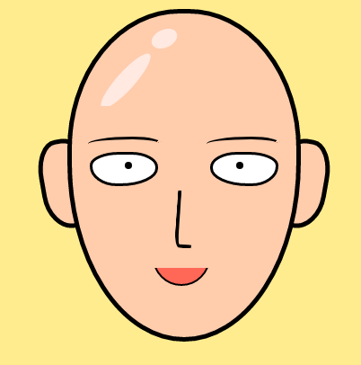
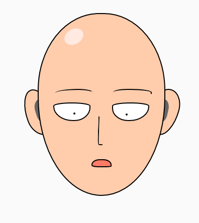

写这篇博客的起因是我看了Medium上的这篇文章：[How I started drawing CSS Images](https://blog.prototypr.io/how-i-started-drawing-css-images-3fd878675c89)，然后哇哦😦，同样是前端开发，这区别怎么这么大呢？这位作者和我完全点了不同的技能点啊！

看了几个她在codepen上的作品，比如这个[皮卡丘](http://codepen.io/sashatran/pen/VmwmJO)，发现用到的技术也并不多，于是我也想试试。

不过有哪个动漫中的人物足够简单，能够用几个基本的几何图形就画出来呢？我想到了一个人，于是我决定画一个《一拳超人》中的<del>卤蛋</del>，不对，是<del>秃头披风侠</del>——琦玉老师。

<!--more-->

结果展示：

<p data-height="450" data-theme-id="dark" data-slug-hash="oZKgMJ" data-default-tab="html,result" data-user="noiron" data-embed-version="2" data-pen-title="One punch man" class="codepen">See the Pen <a href="http://codepen.io/noiron/pen/oZKgMJ/">One punch man</a> by wu kai (<a href="http://codepen.io/noiron">@noiron</a>) on <a href="http://codepen.io">CodePen</a>.</p>
<script async src="https://production-assets.codepen.io/assets/embed/ei.js"></script>


## 技术概述

从html文件中你可以看到这张图片实际上全部是由`div`元素组合而成的，一共用到了15个div。在给一个div元素加上适当的css样式后，就形成了脸上的一个部位。

在绘制琦玉的头像时，最重要的一个css属性就是`border-radius`，我们用它可以画出圆形、椭圆及各种变体。图中的脸部轮廓、眼睛、耳朵的形状都是由`border-radius`来实现的，稍后将介绍其使用方法。

另一个需要说明的css属性是`transform`，可以实现平移和旋转。


## border-radius 介绍

之前我对`border-radius`的认识只局限于可以给元素加上圆角，以及将其值设为50%可以让矩形显示为圆形。查了些资料后，才发现可以用它画出许多图形。

`border-radius`是以下四个属性的简写，每一个属性用于设置一个角的形状：

    border-top-left-radius
    border-top-right-radius
    border-bottom-right-radius
    border-bottom-left-radius


图片来自[MDN](https://developer.mozilla.org/en/docs/Web/CSS/border-radius)

从上图可以看出当只设置一个值或设置两个相同的值时，显示为圆；设置两个不同的值时，显示为椭圆。以`border-top-left-radius`为例：

```css
/* the corner is a circle */
/* border-top-left-radius: radius */
border-top-left-radius: 3px;

/* the corner is an ellipsis */
/* border-top-left-radius: horizontal vertical */
border-top-left-radius: 0.5em 1em;
```

若是简写形式，则写成如下格式：

```css
border-radius: 48% 48% 50% 50% / 42% 42% 54% 54%;
```

'/'之前的四个值表示水平轴的长度，'/'之后的四个值表示垂直轴的长度，当水平轴的长度和垂直轴的长度相等时，可以省略'/'及之后的这一组值。

对于同一组的四个数值，也有简写方式。方法与 padding 和 margin 的简写类似，第一个值与第三个值相同或第二个值与第四个值相同时，可以只写一遍。

在了解了`border-radius`的用法后，通过给`div`元素合适的宽高比，在调整四个圆角的半径，就能够获得你想要的形状了。

```css
// 以下的样式能够画出琦玉的脸部形状
// 在调整width, height, border-radius 后，可画出眼、鼻、嘴的形状
#div1 {
  width: 100px;
  height: 144px;
  border: 2px solid #000;
  border-radius: 48% 48% 50% 50% / 42% 42% 54% 54%; 
}
```

## transform 介绍

[transform属性](https://developer.mozilla.org/en-US/docs/Web/CSS/transform)也是一个很强大的属性，能够对元素做各种变形。不过我们这里只需要用它来进行平移和旋转的操作。

```css
/* 可以用 translate 来实现平移操作 */
/* translate() 的两个参数分别表示水平方向和垂直方向的平移距离 */
transform: translate(12px, 50%);

/* 上面这一行与下面的这两行是等价的 */
transform: translateX(12px);
transform: translateY(50%);

/* 顺时针旋转20度 */
transform: rotate(20deg);
```


## 组合得到最终结果

在你已经将琦玉头像进行拆解，把各个部分都用一个`div`来表示并加上了合适的样式后，就能将它们组合起来了。你可以用`transform`来调整它们的距离，或者直接用`absoulte`定位。

最后就得到了琦玉的头像：



额，秃子，你谁啊！？

看来不是所有的光头都叫琦玉，还需要对细节进行一点调整：



OK，这样就有点像琦玉老师了。最后，如果你愿意的话，还可以用`transition`属性来稍微加上点动画效果。

再放一遍代码地址：

> [Codepen代码及展示](https://codepen.io/noiron/pen/oZKgMJ)


