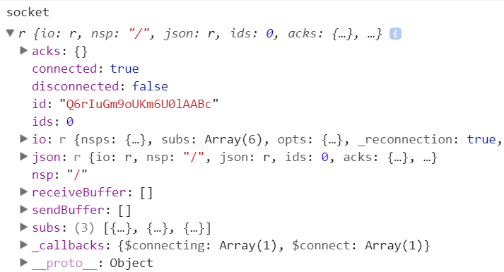
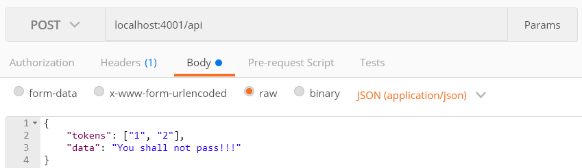
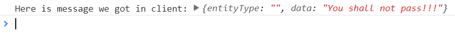

## 项目背景介绍

最近在写的项目中存在着社交模块，需要实现这样的一个功能：当发生了用户被点赞、评论、关注等操作时，需要由服务器向用户实时地推送一条消息。

这里存在着这样的几个对象：
- 用 Java 实现的后端服务器
- 用 Node.js 实现的消息推送服务器
- 用户进行操作的客户端

事件处理的流程如下：

1. 用户进行点赞操作时，后端服务器会进行处理，并向 Node.js 消息推送服务器发送一条消息
2. Node.js 消息推送服务器接收到后端发送的消息后，处理数据，并确定向哪个用户进行推送
3. 用户的客户端接收到由 Node.js 服务器推送来的消息后，即可进行通知的显示。

上面的流程中，Java 后端服务器是如何实现的不在此篇文章的讨论范围内，本文将主要介绍如何使用 Node.js 来实现这个消息推送服务器。

<!-- more -->

考虑消息推送服务器上必须记录下当前在线用户的信息，这样才能向特定的用户推送消息。所以当用户登录时，必须将自身的用户信息发到 Node.js 服务器上。为了达到这种双向的实时消息传递，很明显地考虑用 WebSocket 来实现。既然我们在消息推送服务器上使用了 Node.js，我们就有了一个很方便的选项：socket.io。


## socket.io 介绍

[socket.io](https://socket.io)是一个用 JavaScript 实现的实时双向通信的库，利用它来实现我们的功能会很简单。

`socket.io` 包含两个部分：
- 服务器端（server）：运行在 Node.js 服务器上
- 客户端（client）：运行在浏览器中

可以看看如下的 `socket.io` 的示例代码，它给出了 `socket.io` 发出及监听事件的基本用法：

```js
io.on('connection', function(socket){
  socket.emit('request', /* */); // emit an event to the socket
  io.emit('broadcast', /* */); // emit an event to all connected sockets
  socket.on('reply', function(){ /* */ }); // listen to the event
});
```

关于 Socket.io 还有一点需要注意：Socke.io 并不完全是 WebSocket 的实现。

> Note: Socket.IO is not a WebSocket implementation. Although Socket.IO indeed uses WebSocket as a transport when possible, it adds some metadata to each packet: the packet type, the namespace and the ack id when a message acknowledgement is needed. 

接下来我们需要用 Express.js 来建立一个服务器端程序，并在其中引入 Socket.io。

## Node.js 服务器的搭建

### 利用 Express.js 搭建基础服务器

我们使用了 Express.js 来搭建 Node.js 消息推送服务器，先利用一个简要的例子来浏览其功能：

```js
// server.js
const express = require('express');
const app = express();
const path = require('path');
const http = require('http').Server(app);

const port = 4001;

app.use(express.static(path.join(__dirname, 'public')));

app.get('/', function(req, res) {
    res.sendFile(__dirname + '/public/index.html');
});

app.get('/api', function(req, res) {
    res.send('.');
});

http.listen(port, function() {
    console.log(`listening on port:${port}`);
});
```

将上面的代码保存为 `server.js`，新建一个 `public` 文件夹，在其中放入 `index.html` 文件。运行以下命令：

    node server.js

现在即可在 `localhost:4001` 查看效果了。

### 引入 socket.io 

现在已经有了一个基础的 Express 服务器，接下来需要将 Socket.io 加入其中。

```js
const io = require('socket.io')(http);

io.on('connection', function(socket) {
    console.log('a user connected');
    socket.broadcast.emit('new_user', {});
}
```

这里的 `io` 监听 `connection` 事件，当 `client` 与 `server` 建立了连接之后，这里的回调函数会被调用（`client` 中的代码将在下一节介绍）。

函数的参数 `socket` 代表的是当前的 `client` 和 `server` 间建立的这个连接。可在 `client` 程序中将这个建立的 socket 连接打印出来，如下图所示：



其中的 `id` 属性可以用于标识出这一连接，从而 `server` 可以向特定的用户发送消息。

```js
socket.broadcast.emit('new_user', {});
```

这一行代码表示 `socket` 将向当前所有与 `server` 建立了连接的 `client`（不包括自己） 广播一条名为 `new_user` 的消息。

### 后端推送消息的处理流程 

0. 在 Node 服务器建立一个用户信息和 socket id 的映射表，因为同一用户可能打开了多个页面，所以他的 socket id 可能存在多个值。当用户建立连接时，往其中添加值；用户断开连接后，删除相应值。

1. 当 Java 后台存在需要推送的消息时，会向 Node 服务器的 `/api` 路径 post 一条消息，其中包括用于标识用户的 tokenId 和其它数据。

2. Node 服务器接收到 post 请求后，对请求内容进行处理。根据 tokenId 找出与该用户对应的 socket id，socket.io 会根据 id 来向用户推送消息。


### 对用户信息的处理

方便起见，这里只用一个数组保存用户信息，实际工作中可以根据需要放入数据库中保存。

```js
global.users = []; // 记录下登录用户的tokenId, socketId
```

当用户登录时，`client` 会向 `server` 发送 `user_login` 事件，服务器接收到后会做如下操作：

```js
socket.on('user_login', function(info) {
    const { tokenId, userId, socketId } = info;
    addSocketId(users, { tokenId, socketId, userId });
});
```

`addSocketId()` 会向 `users` 数组中添加用户信息，不同用户通过 tokenId 进行区分，每个用户有一个 `socketIds` 数组，保存可能存在的多个 `socketId`。该函数的具体代码可见 `src/utils.js` 文件。

同理，还有一个 `deleteSocketId()` 函数用于删除用户信息，代码可见同一文件。

在获取了用户的 tokenId 之后，就需要找到对应的 socketId，然后向特定用户推送消息。

```js
// 只向 id = socketId 的这一连接发送消息 
io.sockets.to(socketId).emit('receive_message', {
    entityType,
    data
});
```

服务器的思路大致如此，接下来介绍客户端中是如何进行相应的处理的。

## 客户端

### Socket.io 的初始化

首先在 html 文件中引入 Socket.io 的 client 端文件，例如通过 CDN 引入：

```html
<script src="https://cdnjs.cloudflare.com/ajax/libs/socket.io/2.0.3/socket.io.js"></script>
```

其它的引入方式:

```html
<script src="/socket.io/socket.io.js"></script>
```

```js
const io = require('socket.io-client');
// or with import syntax
import io from 'socket.io-client';
```

引入 Socket.io 后就获得了 `io` 函数，通过它来与消息推送服务器建立连接。

```js
// 假设你将 Node 服务器部署后的地址为：https://www.example.com/ws
// 则： WS_HOST = 'https://www.example.com'
const msgSocket = io(`${WS_HOST}`, {
    secure: true,
    path: '/ws/socket.io'
});
```

如果监听本地：

```js
const msgSocket = io('http://localhost:4001');
```

这里如果写成 `io('https://www.example.com/ws')` 会出现错误，需要将 `/ws` 写入path中。

为了能在其它文件使用这一变量，可将 `msgSocket` 作为一个全局变量：

```js
window.msgSocket = msgSocket;
```

### 用户建立连接

```js
// 用户登录时，向服务器发送用户的信息。服务器会在收到信息后建立 socket 与用户的映射。
msgSocket.emit('user_login', {
    userId,
    socketId: msgSocket.id,
    tokenId
});
```

### 接收到推送的消息后的处理

```js
// WebSocket 连接建立后，监听名为 receive_message 的事件 
msgSocket.on('receive_message', msg => {
    store.dispatch({
        type: 'NEW_SOCKET_MSG',
        payload: msg
    });
});
```

当 WebSocket 服务器向客户端推送了消息之后，客户端需要监听 `receive_message` 事件，接收到的参数中有相应待处理的信息。
由于使用了 Redux 进行数据的处理，所以这里 dispatch 了一个 `NEW_SOCKET_MSG` action，后续则是常规的 redux 处理流程了。


## 项目的使用

GitHub 上的项目地址：[socket-message-push](https://github.com/noiron/socket-message-push)

    npm run dev

即可在 devlopment 环境下进行测试，现在你就有了一个运行在4001端口的消息推送服务器了。

但是这里并没有后端的服务器来向我们发送消息，所以我们将利用 Postman 来模拟发送消息。

为了展示程序的功能，在项目的 client 文件夹下放置了一个 `index.html` 文件。注意这个文件并不能用在实际的项目中，只是用来显示消息推送的效果而已。

在开启了服务器之后，打开 `client/index.html`，根据提示随意输入一个 tokenId 即可。

现在利用 Postman 向 `localhost:4001/api` post 如下的一条信息：

    { 
        // tokens 数组表示你想向哪个用户推送消息
    	"tokens": ["1", "2"], 
    	"data": "You shall not pass!!!"
    }



至此，如果一切顺利，你应该能够在 client 的控制台中看到收到的消息了。



你可以打开多个 client 页面，输入不同的 tokenId，然后检查消息是否发送给了正确的用户。


## 参考资料

> https://github.com/socketio/socket.io/tree/master/examples/chat
> https://socket.io/docs/